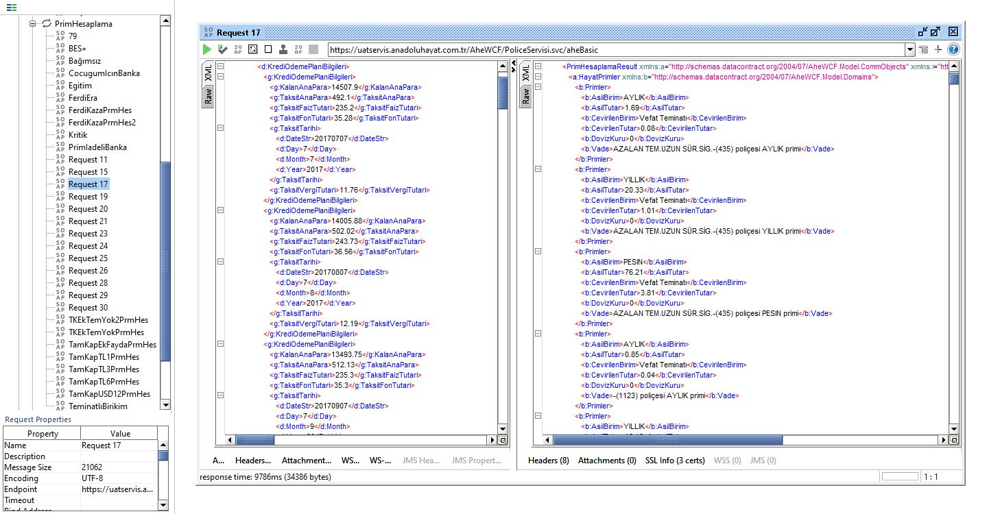

# pySoapAHE
SOAP webservice call w/ Python





## Requirements
The [`requirements.txt`](requirements.txt) file lists all Python libraries that the project depends on, and they can be installed using

```
pip install -r requirements.txt
```

## Examples
### PoliceServisi
* [PoliceSorgula](src/PoliceSorgula.py)